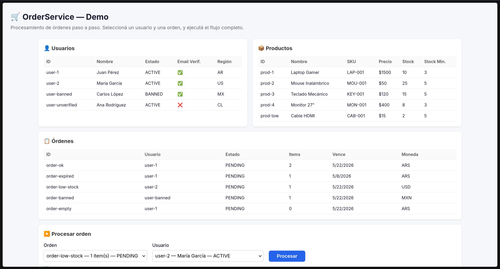

<div align="center">



<h1>Práctico 2 — Ingeniería de Software II</h1>

<p><strong>Refactorización de un servicio monolítico en una arquitectura con responsabilidades separadas, inyección de dependencias y aplicación web demo.</strong></p>

<p>
  
  
  
  
</p>

<p>
  
  
</p>

</div>

---

## Descripción general

Este proyecto corresponde al **Práctico 2 de Ingeniería de Software II**. Se tomó como base el archivo `infladores.py` que contenía un método `processOrder` de ~110 líneas con **14 responsabilidades mezcladas** y se lo refactorizó aplicando **Single Responsibility Principle (SRP)** e **Inversión de Dependencias (DIP)**. El resultado es un `OrderService` con 9 métodos chicos, cada uno con una única tarea, más una aplicación web demo para validar visualmente el funcionamiento.

---

## Explicación simple

### ¿Qué había?

Un archivo llamado `infladores.py` con una clase `OrderService` que tenía **un solo método** llamado `processOrder`. Y ese método hacía **todo**.

Era como ir a un restaurant donde el **mismo chef** tenía que:
1. Tomarte el pedido
2. Verificar si tenés cuenta
3. Ir a la heladera a ver si hay ingredientes
4. Cocinar la comida
5. Cobrarte
6. Lavar los platos
7. Mandarte el mail de agradecimiento
8. Sumarte puntos por fidelidad

Si algo salía mal en el paso 5, el paso 6 ya se había empezado a ejecutar. **Un desastre.**

### ¿Qué infladores se detectaron?

Se detectó **un inflador gigante (God Method)**: un método que hace mucho más de lo que debería. Concretamente, **14 cosas distintas**:

| # | Responsabilidad | Si cambia... |
|---|----------------|-------------|
| 1 | Buscar usuario en la BD | Tocás TODO el método |
| 2 | Verificar que no esté baneado | ídem |
| 3 | Verificar email verificado | ídem |
| 4 | Ejecutar verificación KYC | ídem |
| 5 | Buscar la orden en la BD | ídem |
| 6 | Validar orden (dueño, estado, expiración, items) | ídem |
| 7 | Revisar stock de cada producto | ídem |
| 8 | Calcular subtotal + descuento + impuestos | ídem |
| 9 | Obtener método de pago y cobrar | ídem |
| 10 | Descontar el stock | ídem |
| 11 | Alertar si queda poco stock | ídem |
| 12 | Guardar la orden como confirmada | ídem |
| 13 | Mandar email + evento de confirmación | ídem |
| 14 | Sumar puntos de fidelidad | ídem |

**110 líneas, 14 razones para cambiar.** Eso es un inflador.

### ¿Cómo se refactorizó?

Se aplicó **SRP**: cada método hace UNA sola cosa. El `processOrder` ahora es un pipeline que se lee de arriba a abajo:

```
1. validarUsuario      → buscar usuario, verificar estado, email y KYC
2. validarOrden        → buscar orden, verificar dueño, estado y vigencia
3. validarProductos    → verificar stock de cada producto
4. calcularSubtotal    → sumar precios
5. calcularTotal       → aplicar descuento + impuestos
6. procesarPago        → cobrar y manejar fallos
7. descontarStock      → reducir inventario y alertar si falta
8. finalizarOrden      → guardar orden como confirmada
9. notificar           → enviar email, evento y puntos de fidelidad
```

Cada paso es un **método privado separado**. Si mañana cambia el cálculo de impuestos, solo tocás `calculateTotal`. Si cambia la validación de usuarios, solo tocás `getValidatedUser`. El resto no se entera.

---

## Del código original al refactorizado

### Lo que había vs. lo que se creó

```
ANTES                                    DESPUÉS
──────────────────────────────────────────────────────────────────
infladores.py (1 archivo, 1 clase)
                                         src/types.ts              (NUEVO)
                                         src/OrderService.ts       (REFACTORIZADO)
                                         src/infrastructure/
                                           repos.ts                (NUEVO)
                                           services.ts             (NUEVO)
                                           eventBus.ts             (NUEVO)
                                         src/seed.ts               (NUEVO)
                                         src/main.ts               (NUEVO)
                                         index.html                (NUEVO)
```

### Rastreo: cada línea del original fue a parar a un método específico

| Código original (`infladores.py`) | Archivo nuevo | Método nuevo |
|-----------------------------------|---------------|-------------|
| Buscar usuario + validar (baneado, email, KYC) | `src/OrderService.ts` | `getValidatedUser()` |
| Buscar orden + validar (dueño, estado, expiración) | `src/OrderService.ts` | `getValidatedOrder()` |
| Validar stock de cada producto | `src/OrderService.ts` | `validateItems()` |
| Calcular subtotal | `src/OrderService.ts` | `calculateSubtotal()` |
| Aplicar descuentos + impuestos | `src/OrderService.ts` | `calculateTotal()` |
| Obtener método de pago + cobrar | `src/OrderService.ts` | `processPayment()` |
| Descontar stock + alertar bajo | `src/OrderService.ts` | `deductStock()` |
| Guardar orden como confirmada | `src/OrderService.ts` | `finalizeOrder()` |
| Email + evento + puntos fidelidad | `src/OrderService.ts` | `notifyConfirmation()` |
| Dependencias (implícitas) | `src/types.ts` | Interfaces (`UserRepo`, `OrderRepo`, etc.) |
| Implementaciones concretas | `src/infrastructure/repos.ts` | `InMemoryUserRepo`, etc. |
| Stubs de servicios | `src/infrastructure/services.ts` | `StubPaymentGateway`, etc. |
| Bus de eventos | `src/infrastructure/eventBus.ts` | `InMemoryEventBus` |
| Datos de prueba | `src/seed.ts` | `seedData()` |
| Wiring + UI | `src/main.ts` + `index.html` | Controlador y vista |

### Mejoras incorporadas en la refactorización

- **Sin código duplicado**: antes se recorría la lista de items dos veces (validar stock y descontar). Ahora `validateItems()` devuelve los productos ya resueltos y `deductStock()` los reutiliza.
- **Sin efectos secundarios ocultos**: antes el pago se cobraba y después, si fallaba el descuento de stock, no había rollback. Ahora el pipeline es secuencial y explícito.
- **Idioma consistente**: se unificaron los mensajes de error.
- **Inyección de dependencias**: el servicio recibe todo por constructor. No crea nada internamente.

---

## Arquitectura actual

### Diagrama

```
┌──────────────────────────────────────────────────────┐
│                    index.html                         │
│  (UI que muestra datos, botón y resultados)          │
└──────────────────────┬───────────────────────────────┘
                       │ llama
┌──────────────────────▼───────────────────────────────┐
│                    main.ts                            │
│  (crea dependencias, conecta UI con servicio)        │
└──────┬──────────┬──────────┬──────────┬──────────────┘
       │          │          │          │
       ▼          ▼          ▼          ▼
┌──────────┐ ┌──────────┐ ┌──────────┐ ┌──────────────┐
│ repos.ts │ │services.ts││eventBus.ts││  seed.ts     │
│ (en mem) │ │  (stubs)  │ │(en mem)  ││ (datos demo) │
└────┬─────┘ └────┬─────┘ └────┬─────┘ └──────────────┘
     │            │            │
     └────────────┴────────────┘
                    │ implementan las interfaces de types.ts
                    ▼
          ┌──────────────────┐
          │   OrderService   │  ← solo conoce interfaces,
          │  (refactorizado) │    no sabe qué implementación
          └──────────────────┘    se le pasó
```

**Clave:** el `OrderService` solo importa `types.ts`. No sabe que existen `InMemoryUserRepo`, `StubPaymentGateway` ni `InMemoryEventBus`. Para conectar una base de datos real, creás `PostgresUserRepo implements UserRepo` y se lo pasás al constructor. El servicio ni se entera.

### Cómo funciona hoy

Cuando abrís `http://localhost:3000`:

1. **Carga** → `index.html` importa el bundle `dist/app.js` (compilado con esbuild)
2. **Inicialización** → `main.ts` crea todas las implementaciones en memoria y las inyecta en `OrderService`, luego `seedData()` precarga usuarios, productos y órdenes
3. **Interacción** → seleccionás una orden y un usuario, apretás "Procesar"
4. **Ejecución** → `orderService.processOrder(orderId, userId)` corre el pipeline de 9 pasos
5. **Resultado** → si es exitoso, muestra el JSON de la orden confirmada. Si falla, muestra el error exacto ("Usuario prohibido", "Order expirado", etc.)
6. **Efectos secundarios** → los paneles de eventos, emails, alertas y puntos se actualizan automáticamente

---

## Estructura del proyecto

```txt
src/
  types.ts                        # Interfaces del dominio y contratos
  OrderService.ts                 # Servicio refactorizado con SRP
  infrastructure/
    repos.ts                      # Repositorios en memoria (User, Order, Product, Payment)
    services.ts                   # Stubs de servicios (KYC, Promo, Tax, Payment, Alert, Email, Loyalty)
    eventBus.ts                   # Event bus en memoria
  seed.ts                         # Datos de prueba con 5 escenarios
  main.ts                         # Entry point: wiring, controlador de UI
index.html                        # Interfaz web de prueba
package.json                      # Build config con esbuild
tsconfig.json                     # Configuración de TypeScript
```

---

## Escenarios de prueba

| Orden | Usuario | Escenario | Resultado esperado |
|-------|---------|-----------|-------------------|
| `order-ok` | `user-1` (Juan Pérez) | Flujo exitoso completo | ✅ Orden confirmada, email enviado, puntos acumulados |
| `order-expired` | `user-1` | Orden vencida | ❌ "Order expirado" |
| `order-low-stock` | `user-2` (María García) | Stock insuficiente (pide 5, hay 2) | ❌ "Insuficiente stock" |
| `order-banned` | `user-banned` (Carlos López) | Usuario suspendido | ❌ "Usuario prohibido" |
| `order-empty` | `user-1` | Orden sin items | ❌ "orden vacia" |

---

## Ejecución

```bash
npm install
npm run build     # Compila TypeScript a dist/app.js
npx serve .       # Abre http://localhost:3000
```

O en un solo paso:

```bash
npm start
```

---

## Conclusión

Se transformó un método monolítico de 110 líneas con 14 responsabilidades en una arquitectura basada en **inyección de dependencias** y **responsabilidades separadas**. El `OrderService` refactorizado permite:

- Cambiar reglas de negocio tocando un solo método
- Intercambiar implementaciones (memoria, BD real, APIs externas) sin modificar el servicio
- Validar visualmente el flujo completo desde la aplicación web demo

La refactorización cumple con los principios **SOLID** aplicados al diseño de software, demostrando que un código bien estructurado es más mantenible, más fácil de probar y más sencillo de extender.
